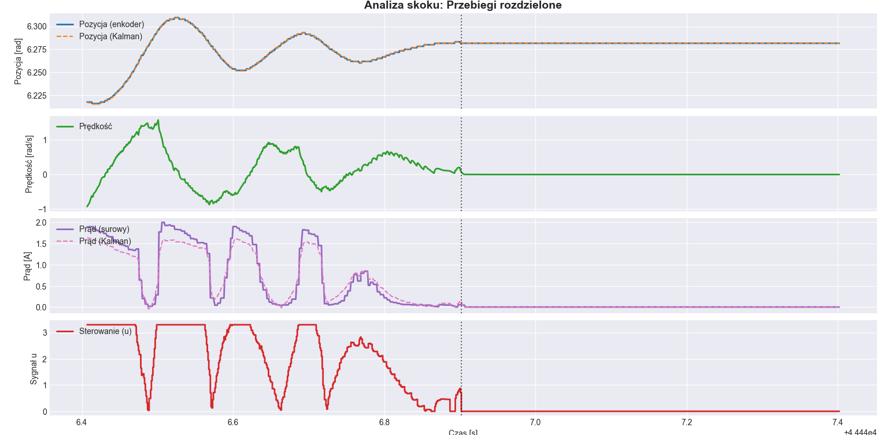
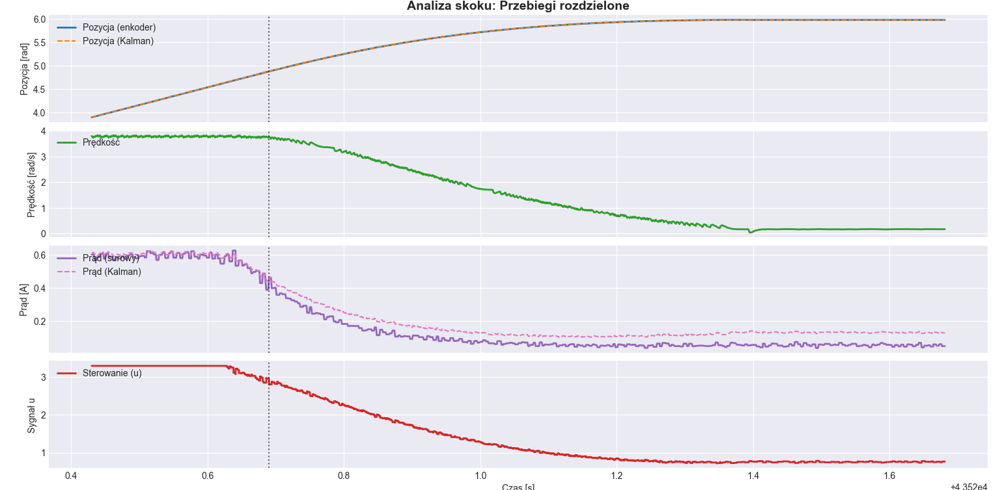
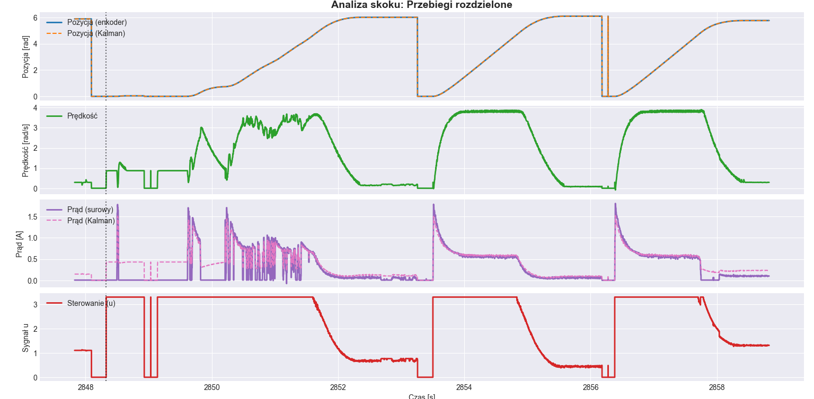

# Projekt USO: Sterowanie Optymalne Silnikiem DC (LQG)

Projekt realizuje zaawansowany system sterowania położeniem wału silnika prądu stałego (DC) w architekturze **LQG (Linear Quadratic Gaussian)**. System łączy optymalną regulację kwadratową (LQR) z optymalną estymacją stanu (Filtrem Kalmana), co pozwala na precyzyjną kontrolę obiektu w warunkach szumu pomiarowego i ograniczonej dostępności zmiennych stanu.

## 1. Założenia Projektu
[cite_start]System został zaprojektowany dla zestawu deweloperskiego **NUCLEO-L476RG** z procesorem **Arm Cortex-M4**[cite: 7, 11]. Głównym celem jest stabilizacja kąta obrotu wału silnika przy minimalizacji uchybu oraz energii sterowania.

**Kluczowe cechy:**
* Pełna identyfikacja parametrów silnika na podstawie odpowiedzi skokowej.
* Implementacja dwóch profili sterowania: `SPORT` (agresywny) oraz `COMFORT` (płynny).
* Wykorzystanie filtru Kalmana do odtwarzania prędkości kątowej oraz filtracji pomiaru prądu.
* Czas próbkowania systemu kontroli: **1 ms**.

## 2. Model Matematyczny Silnika
Model silnika DC opisano w przestrzeni stanów dla wektora stanu $x = [\theta, \omega, i]^T$ (pozycja, prędkość, prąd).

### Zidentyfikowane parametry obiektu:
* **R (Rezystancja):** 2.9 $\Omega$
* **L (Indukcyjność):** 0.006 H
* **k_e / k_t (Stałe silnika):** $\approx 0.3922$
* **J (Moment bezwładności):** $\approx 0.0148$
* **b (Współczynnik tarcia):** $\approx 0.0611$

### Macierze Stanu (Postać Ciągła):
$$\dot{x} = Ax + Bu$$
$$A = \begin{bmatrix} 0 & 1 & 0 \\ 0 & -4.118 & 26.426 \\ 0 & -65.368 & -483.33 \end{bmatrix}, \quad B = \begin{bmatrix} 0 \\ 0 \\ 166.67 \end{bmatrix}$$

## 3. Regulator LQR – Sterowanie Optymalne
Regulator LQR (Linear Quadratic Regulator) wyznacza sterowanie $u$ (napięcie), które jest matematycznie optymalne pod kątem minimalizacji wskaźnika jakości $J$:
$$J = \int_{0}^{\infty} (x^T Q x + u^T R u) dt$$

Gdzie:
* **Macierz Q:** zawiera wagi (kary) za odchylenia zmiennych stanu od wartości zadanych.
* **Macierz R:** definiuje koszt (karę) za zużycie energii sterowania.

### Skąd bierze się wzmocnienie F?
Wzmocnienie $F$ (w kodzie jako tablica `F[3]`) jest wyliczane poprzez rozwiązanie **algebraicznego równania Riccatiego (ARE)**. Pozwala ono na realizację sterowania w postaci ujemnego sprzężenia zwrotnego od pełnego stanu:
$$u = -F \cdot x$$

W projekcie zastosowano również wzmocnienie **N_bar** (sprzężenie w przód), które skaluje sygnał zadany tak, aby system osiągał dokładnie pożądany kąt bez uchybu ustalonego.

## 4. Filtr Kalmana (Obserwator Stanu)
Ponieważ system posiada tylko czujniki pozycji (enkoder) i prądu (sensor INA237), prędkość kątowa musi być estymowana. Filtr Kalmana realizuje to zadanie w dwóch etapach:
1.  **Predykcja:** Przewidywanie kolejnego stanu na podstawie modelu fizycznego i napięcia $u$.
2.  **Korekcja:** Porównanie przewidywań z pomiarami i aktualizacja estymaty stanu z uwzględnieniem szumu procesu i pomiaru.

Dzięki temu system dysponuje czystym sygnałem prędkości bez opóźnień typowych dla klasycznych filtrów dolnoprzepustowych.

## 5. Konfiguracja Sprzętowa
[cite_start]Konfiguracja peryferiów została wykonana w środowisku STM32CubeMX[cite: 7].

* [cite_start]**Timer 2:** Generuje przerwania co 1 ms, taktując pętlę sterowania[cite: 297, 436].
* **Timer 3:** Pracuje w trybie enkodera (piny PA6, PA7)[cite: 308, 426].
* [cite_start]**Timer 4:** Generuje sygnał PWM (PB6) do sterowania mostkiem H[cite: 341, 426].
* [cite_start]**I2C2:** Odczyt danych z sensora INA237 (400 kHz)[cite: 276, 426].
* **USART2:** Telemetria danych sterownika (115200 bps)[cite: 392, 426].

## 6. Wyniki i Analiza Przebiegów
Wykresy przedstawiające zachowanie układu znajdują się w folderze `Multimedia/`.

### Profil SPORT
Maksymalna szybkość odpowiedzi kosztem oscylacji i gwałtownych zmian prądu (nawet do 2.0A).

### Profil COMFORT
Optymalne, gładkie dojście do pozycji bez przeregulowań. Widoczna skuteczna filtracja szumu prądu przez filtr Kalmana (różowa linia vs fioletowy pomiar surowy).

### Praca Cykliczna
Stabilne podążanie za zmianami wartości zadanej przy ograniczeniu napięcia do $\pm 3.3V$.

